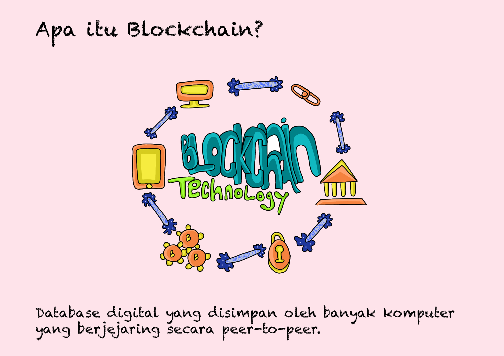
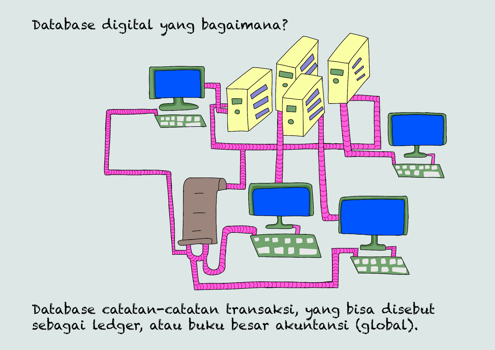

# 🔏 Bagian 1 - Blockchain...

Sebelum kita berkenalan dengan DeFi atau Decentralized Finance, ada dua hal yang perlu kita pahami terlebih dahulu, yang mana kedua hal tersebut sudah sangat populer saat ini.

Yang pertama adalah tentang teknologi blockchain. Apa itu teknologi blockchain?

<figure><figcaption>
Database Digital Di Banyak Komputer
</figcaption></figure>

Secara sederhana, teknologi blockchain adalah sebuah mekanisme cara yang dipakai untuk menyimpan database digital di banyak komputer yang terhubung secara peer-to-peer.

<figure><figcaption>
Catatan Transaksi Di Buku Besar Akuntansi
</figcaption></figure>

Database itu berupa catatan-catatan transaksi. Hal tersebut menjadikan blockchain bisa disebut sebagai ledger, atau buku besar akuntansi.

***
