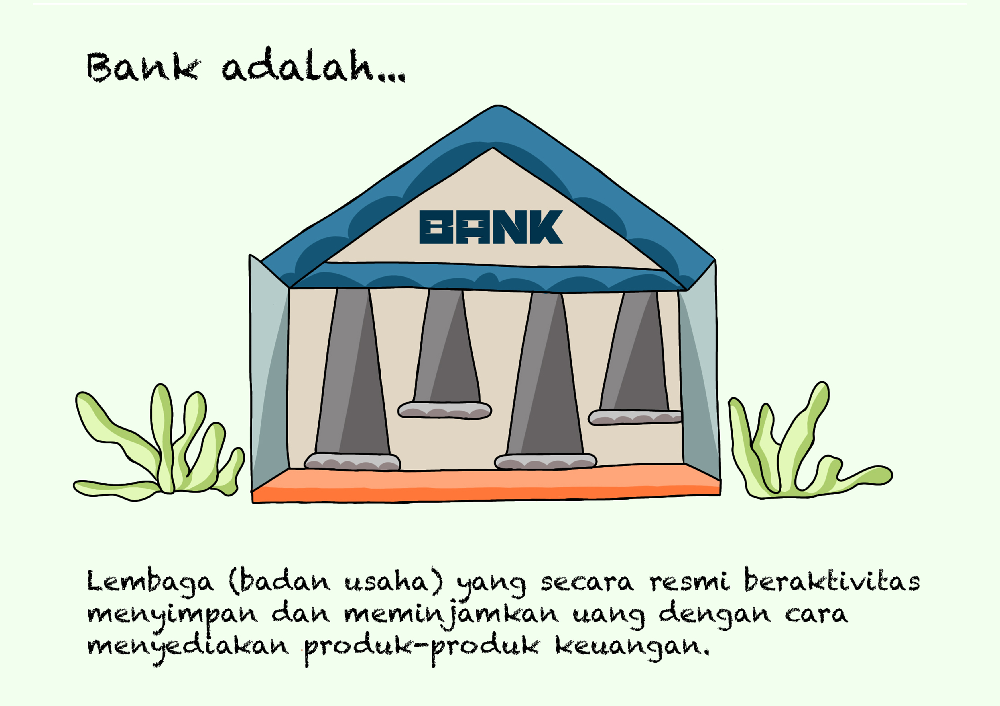
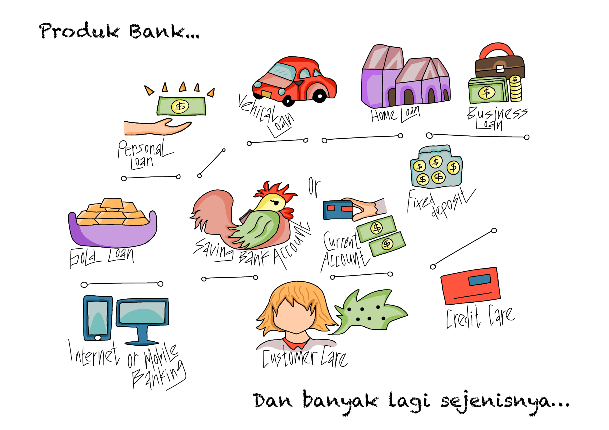
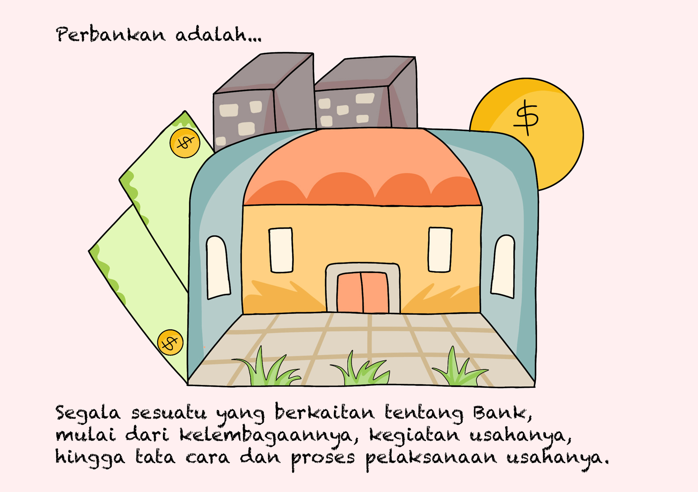

# 🏦 Bagian 2 - Perbankan...

Sekarang kalian sudah tahu apa itu blockchain. Lalu hal berikutnya yang perlu kita pahami adalah perbankan. Apa itu perbankan?

Sebelum kita memahami apa itu perbankan, mari kita pahami dulu apa itu bank dan produk-produknya.

<figure><figcaption>
Badan Usaha Penyedia Produk-Produk Keuangan
</figcaption></figure>

Bank adalah lembaga atau badan usaha yang didirikan secara resmi dan beraktivitas menyimpan dan meminjamkan uang dengan cara menyediakan produk-produk keuangannya sendiri.

<figure><figcaption>
Produk-Produk Keuangan Dari Bank
</figcaption></figure>

Produk-produk keuangan yang disediakan oleh bank diantaranya adalah pinjaman, tabungan, deposito, asuransi, pembayaran, dan lain sebagainya.

<figure><figcaption>
Segala Sesuatu Yang Berkaitan Tentang Bank
</figcaption></figure>

Sedangkan perbankan adalah segala hal yang berkaitan dengan bank, mulai dari kelembagaannya, kegiatan usahanya, hingga tata cara dan proses pelaksanaan usahanya.

Perbankan sudah ditentukan dan diatur oleh negara. Sehingga setiap bank yang didirikan harus patuh dengan aturan yang sudah ditentukan oleh negara di mana bank tersebut didirikan.

***
