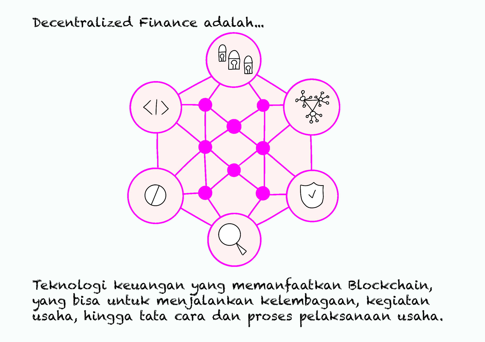
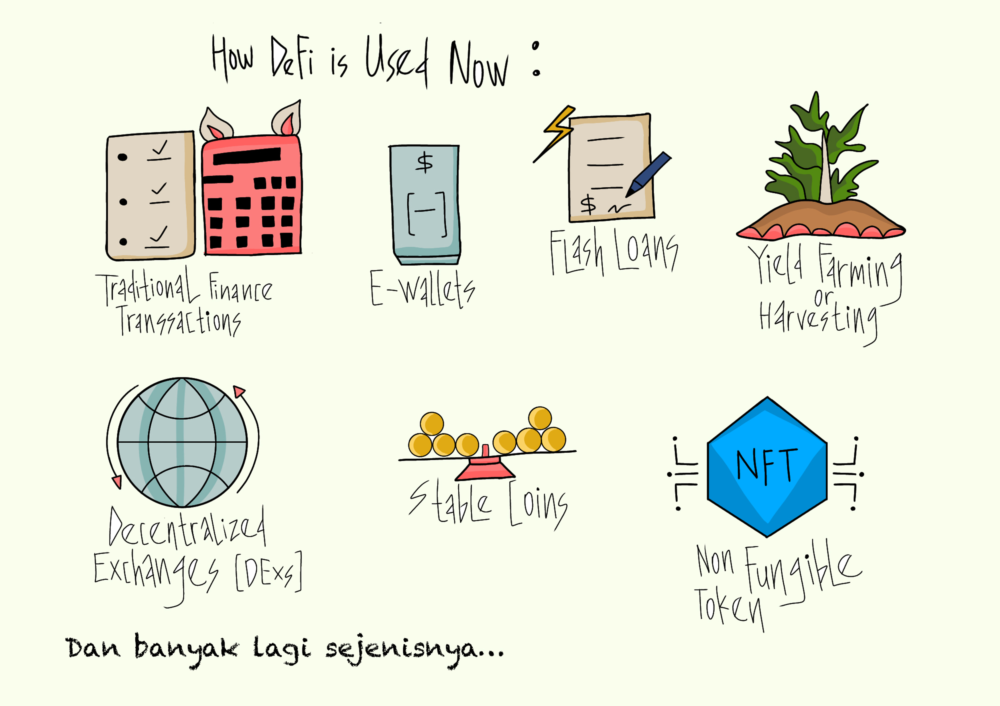

# 💰 Bagian 3 - DeFi...

Sampai di sini kita sudah paham apa itu blockchain dan perbankan. Selanjutnya kita akan berkenalan dengan DeFi atau Decentralized Finance.

Apa itu Decentralized Finance?

<figure><figcaption>
Teknologi Keuangan Yang Memanfaatkan Blockchain
</figcaption></figure>

Decentralized Finance adalah sebuah teknologi keuangan yang memanfaatkan blockchain, tidak memanfaatkan negara. Teknologi keuangan ini berlaku sama seperti perbankan, sehingga Decentralized Finance bisa digunakan untuk menjalankan kelembagaan, kegiatan usaha, hingga tata cara, dan proses pelaksanaan usahanya. Semua ditentukan dan diatur dengan memanfaatkan blockchain, tidak ditentukan dan diatur oleh negara.

<figure><figcaption>
Penggunaan Decentralized Finance
</figcaption></figure>

Dengan demikian, siapa saja, di mana saja, dan kapan saja bisa menyediakan produk-produk keuangannya sendiri dengan menggunakan teknologi keuangan yang disebut Decentralized Finance ini.

Produk-produk keuangan yang menggunakan Decentralized Finance hari ini sudah banyak, beberapa di antaranya adalah untuk pinjaman (flash loans), tabungan (yield farming), money changer (decentralized exchanges), perdagangan kripto, perdagangan NFT, dan masih banyak lagi lainnya.

***
