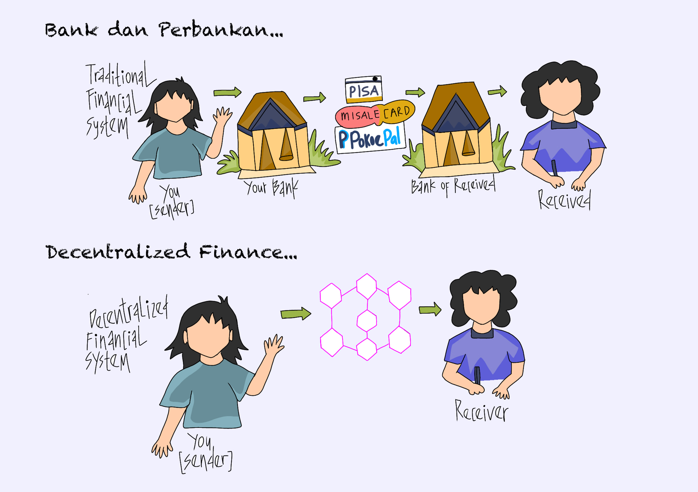

# ♻️ Bagian 4 - Perbedaan...

Lalu apa perbedaan dari perbankan dan Decentralized Finance?

Ilustrasi berikut ini akan sedikit memberikan gambaran sederhana tentang perbedaan mendasar antara perbankan dan Decentralized Finance.

<figure><figcaption>
Antara Perbankan dan Decentralized Finance
</figcaption></figure>

Secara sederhana bisa dibilang bahwa proses yang terjadi di bank dan perbankan ketika seseorang melakukan sebuah transaksi akan selalu melibatkan pihak ketiga sebelum akhirnya transaksi tersebut selesai dilakukan.

Contohnya, ketika si A mengirimkan uang kepada si B, maka uang tersebut akan dikirim ke rekening bank si A, lalu oleh bank tersebut uang yang dikirim diteruskan ke rekening bank si B, baru setelah itu si B bisa mengambil uangnya dari rekening bank si B.

Sedangkan Decentralized Finance setiap transaksi terjadi secara langsung antar pengguna. Sebagai contoh, ketika si A mengirim uang kepada si B, maka si A akan mengirimkan uang dari dompetnya secara langsung ke dompet si B, sehingga si B bisa mengambil uang di dompetnya.

Transaksi yang terjadi ditempuh dengan jalur lebih pendek dan tidak melibatkan pihak ketiga, yaitu bank pengirim dan bank penerima. Hal tersebut membuat proses transaksi terjadi lebih cepat, lebih murah, dan transparan karena dicata di dalam blockchain.

***
