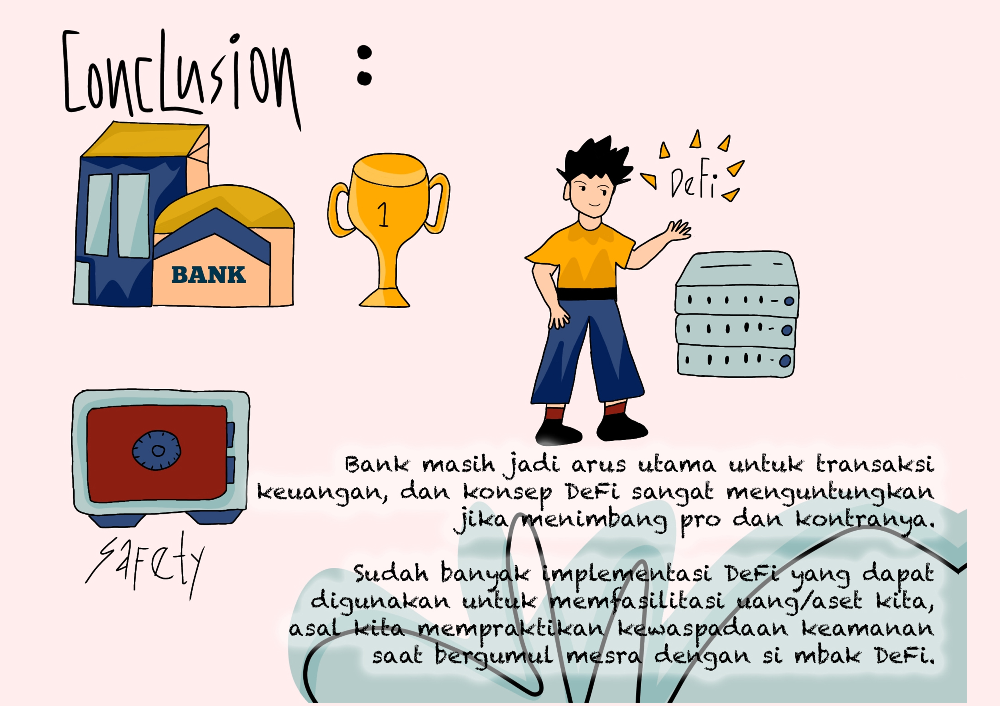

# 💡 Bagian 5 - Kesimpulan...

Sebagai kesimpulan dari materi ini...

Bank dan perbankan masih digunakan sebagai arus utama untuk berbagai aktivitas keuangan, meskipun apa yang ditawarkan oleh Decentralized Finance sangat menguntungkan, jika menimbang pro dan kontranya.

<figure><figcaption>
Kesimpulan Tentand Decentralized Finance
</figcaption></figure>

Kenyataannya, hari ini sudah sangat banyak implementasi dari Decentralized Finance yang dapat digunakan untuk memfasilitasi uang dan aset kita. Keuntungan yang ditawarkan pun cukup beragam dan menggiurkan. Semua itu akan sangat bermanfaat asalkan kita tetap mempraktikkan kewaspadaan keamanan kita saat sedang bergumul mesra dengan si Mbak DeFi ini.

***
